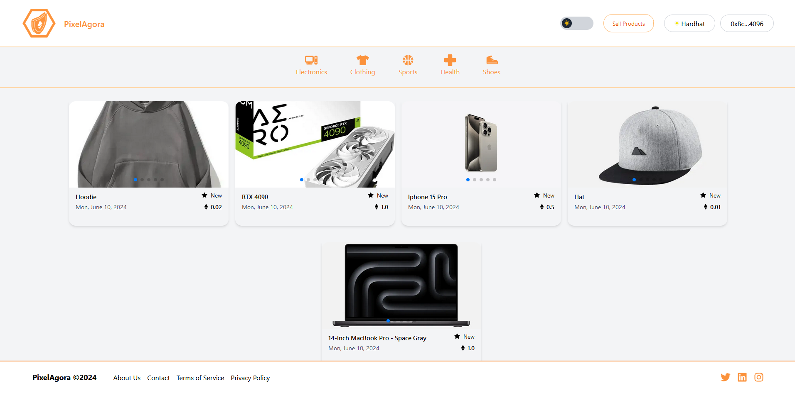

# PixelAgora Project Documentation


The PixelAgora project is a decentralized application built on the Ethereum blockchain. It is a Blockchain Marketplace where users can sell, buy, review and rate products. The project revolves around `DappMrkt.sol`, a Solidity-written Ethereum smart contract. It leverages the OpenZeppelin library to ensure secure and standardized development of the contract.


The core of the contract is defined by three primary structures: `ProductStruct`, `PurchaseStruct`, and `ReviewStruct`, representing an product, a purchase, and a review, respectively.

## Key Features

- `createProduct`: Allows a user to create a new product listing.
- `updateProduct`: Allows the product owner to update the details of a product.
- `deleteProduct`: Allows the product owner to delete a product listing.
- `getProducts`: Allows a user to fetch all available products.
- `getProduct`: Allows a user to fetch the details of a specific product.
- `buyProduct`: Allows a user to buy a product for specific dates.
- `approveProduct`: Allows a customer to approve the purchase and triggers the payment process.
- `claimFunds`: Allows the apartment owner to claim funds after a booking is completed.
- `refundPurchase`: Allows a customer to cancel a purchase and get a refund.
- `getUnavailableDates`: Allows a user to fetch all purchase dates for a specific product.
- `getPurchases`: Allows a user to fetch all purchases for a specific product.
- `getPurchase`: Allows a user to fetch the details of a specific purchase.
- `getQualifiedReviewers`: Allows customers to add a review for a product only if they have purchased and approved it.
- `addReview`: Allows a customer to add a review for an product.
- `getReviews`: Allows a user to fetch all reviews for a specific product.

## Running the Application

Supply the following keys in your `.env` variable:

```sh
NEXT_PUBLIC_RPC_URL=http://127.0.0.1:8545
NEXT_PUBLIC_ALCHEMY_ID=<YOUR_ALCHEMY_PROJECT_ID>
NEXT_PUBLIC_PROJECT_ID=<WALLET_CONNECT_PROJECT_ID>
NEXTAUTH_URL=http://localhost:3000
NEXTAUTH_SECRET=somereallysecretsecret
```

`YOUR_ALCHEMY_PROJECT_ID`: [Get Key Here](https://dashboard.alchemy.com/)
`WALLET_CONNECT_PROJECT_ID`: [Get Key Here](https://cloud.walletconnect.com/sign-in)

Follow these steps to run the application:

1. If you are using windows run the command: `Set-ExecutionPolicy -Scope Process -ExecutionPolicy Bypass`
2. Install the package modules by running the command: `yarn install`
3. Start the Hardhat server: `yarn blockchain`
4. Run the contract deployment script: `yarn deploy`
5. Spin up the Next.js development server: `yarn dev`

Now, your application should be up and running.

##  Key Technologies

- Next.js: A React framework for building server-side rendered and static websites.
- TypeScript: A statically typed superset of JavaScript.
- Hardhat: A development environment for Ethereum smart contracts.
- EthersJs: A library for interacting with Ethereum and Ethereum-like blockchains.
- Redux-Toolkit: A library for managing application state.
- Tailwind CSS: A utility-first CSS framework.
